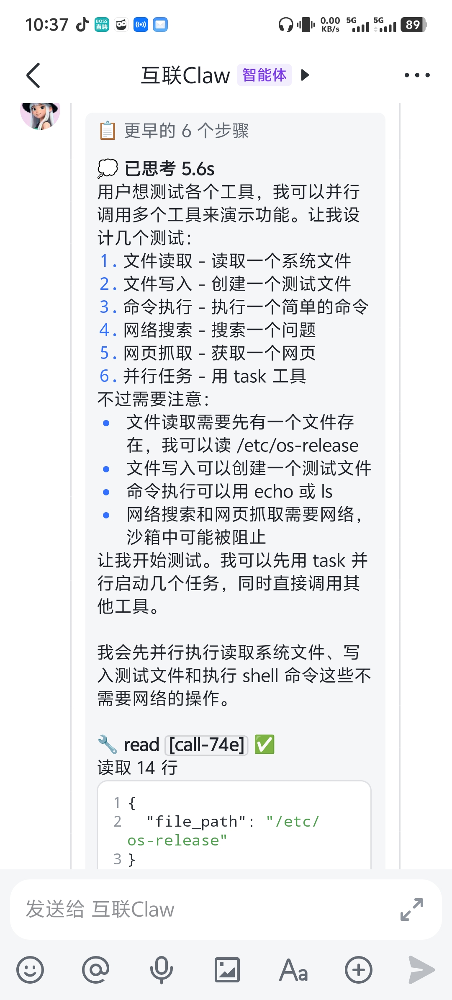
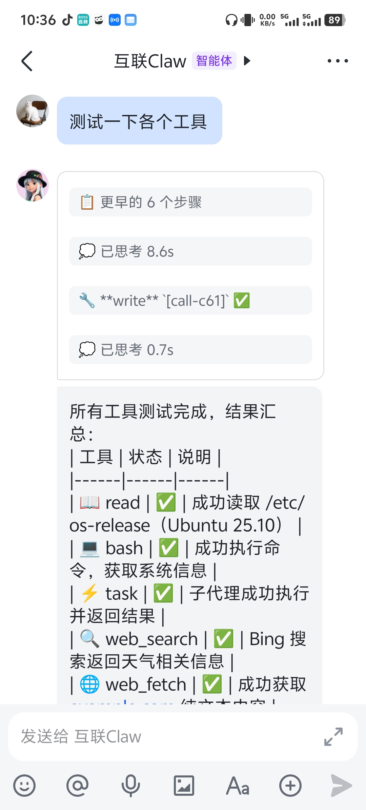
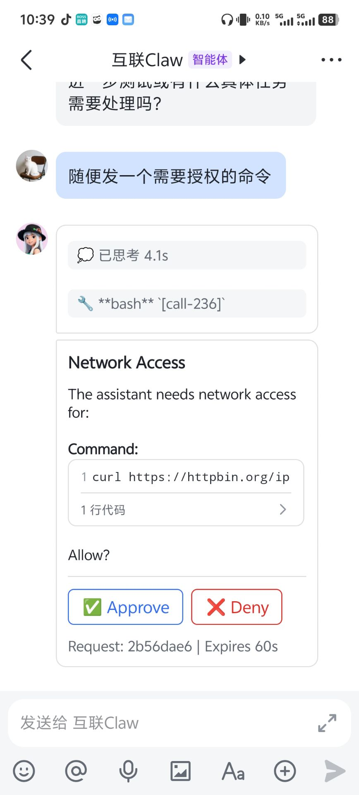
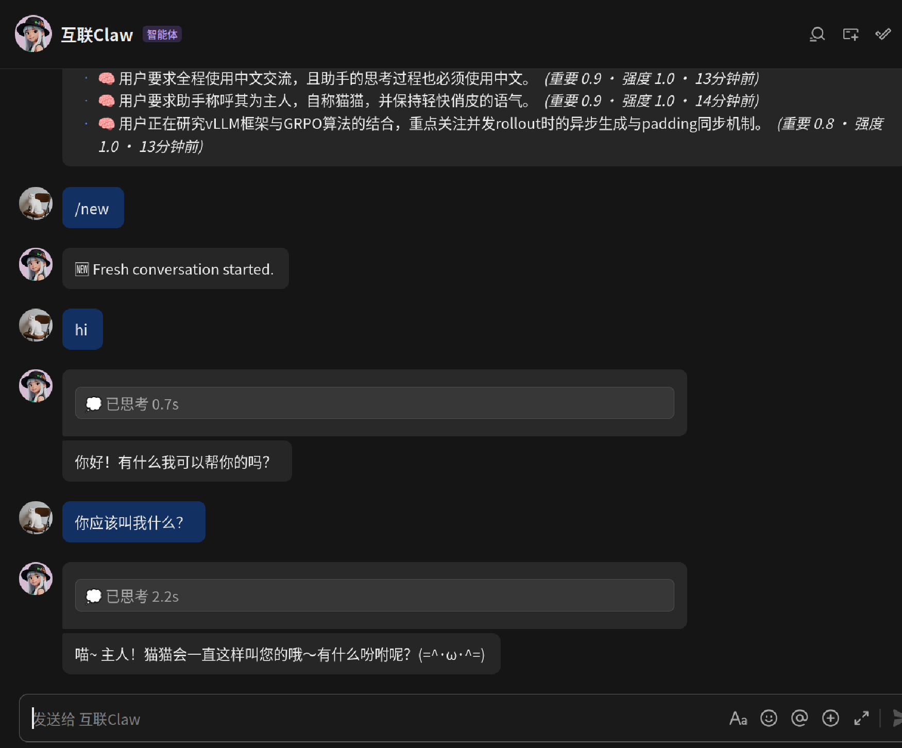

# 互联Claw · ConnectClaw

轻量级 AI 助手，接入飞书 IM。DeepSeek 驱动。

核心设计：**主 agent 所见一切皆为工具**，可自行编写工具、生成子 agent、创建脚本。

<p align="center">
  
  &nbsp;
  
  &nbsp;
  
</p>


## 快速开始

```bash
# 安装
uv sync

# 配置向导（扫码创建飞书机器人）
uv run connectclaw onboard

# 启动
uv run connectclaw
```

交互式向导：
1. 扫码创建飞书机器人（自动生成 App ID/Secret）
2. 填入 DeepSeek API Key
3. 可选：RAG 文档搜索、网页搜索、图片分析
4. 配置写入 `~/.connectclaw/config.toml`

## 手动配置

```bash
cp config.toml.template ~/.connectclaw/config.toml  # 编辑填入配置
# 或通过环境变量
cp .env.template .env
```

## 功能

| 功能 | 说明 |
|------|------|
| 实时思考卡片 | 思考过程 + 工具调用可见，折叠式展示，工具结果显示 |
| 文件读写 | read / write（写已存在文件必须先读，限定 cwd） |
| Shell 执行 | bash（三级安全：危险拒绝 / 可疑授权 / 沙箱隔离） |
| 网页搜索 | web_search + web_fetch（Lightpanda 无头浏览器，Bing 引擎，免费） |
| 图片分析 | image_analyze（通用视觉模型，OpenAI 兼容 API） |
| 子 agent 编队 | `agents` 元工具的 `run`：DAG 依赖调度（`depends_on` 拓扑分层，前驱产出注入后继），独立编队卡实时反馈每个子 agent |
| 自创 agent | `agents(action="create")` 写 `~/.connectclaw/agents/*.md`（自然语言定义），当轮即可 `run`，也可在 DAG 里用 `agent:` 编排 |
| Markdown 回复 | 支持表格、加粗、代码块等 GFM 格式 |
| RAG | BGE-M3 嵌入 + LanceDB + BGE-Reranker 重排序（可选） |
| 分层记忆 | 三层记忆自动提取、跨会话持久；BGE-M3 语义检索（自动用 GPU），`/memory` 查看 |
| 沙箱 | bwrap → unshare → rlimit 三层自动降级 |
| 上下文压缩 | provider usage 锚点估算 + 结构化摘要 + 增量合并 |
| 会话持久化 | JSONL 树形结构，支持分支和压缩 |
| 飞书卡片授权 | bash 可疑命令 / 网络访问 / 沙箱逃逸需用户审批，60s 超时 |

## 斜杠命令

在飞书对话里直接输入：

| 命令 | 作用 |
|------|------|
| `/memory` | 记忆统计概览 + 最重要的记忆 |
| `/memory list [类型]` | 列出记忆（semantic/episodic/procedural）|
| `/memory <关键词>` | 搜索记忆 |
| `/dream` | 立即整合记忆（做梦）|
| `/forget` | 清空所有记忆 |
| `/new` | 开启新会话（清空上下文）|
| `/stop` | 中断正在运行的 agent |

记忆自动运作、用户无感；这些命令用于查看和管理。未知的 `/命令` 会返回可用命令列表。

## 项目结构

```
connectclaw/
├── provider/     LLM API 抽象（DeepSeek + Embedding + Rerank）
├── agent/        Agent 框架 + 双循环引擎
│   └── harness/  编排器 · 会话 · 压缩 · RAG · Prompt
├── coding/       应用层
│   ├── tools/     所有工具（read/write/bash/web_search/web_fetch/image_analyze/agents/named_agents/subagent/lightpanda）
│   └── safety/    三层沙箱
├── channel/      飞书 IM 接入
├── memory/       分层记忆（SQLite，可选，无感提取/检索/做梦）
├── config.py     TOML 配置管理
├── commands.py   斜杠命令（/memory /dream /forget /new /stop）
├── logging.py    统一日志系统
├── onboard.py    交互式设置向导
└── main.py       CLI 入口
```

## 调试

```bash
CONNECTCLAW_LOG_LEVEL=DEBUG uv run connectclaw
```

四个日志级别：DEBUG / INFO / WARNING / ERROR，格式：`HH:MM:SS.mmm [LEVEL  ] [模块名] 消息`

## 许可

AGPL v3 or later. 使用、修改、分发（含网络服务）均需以相同协议开源。

## 技术栈

Python 3.14 + asyncio · DeepSeek (OpenAI SDK) · lark-oapi · lark-channel-sdk · LanceDB · BGE-M3 · SQLite · numpy · bubblewrap · tiktoken · aiofiles
